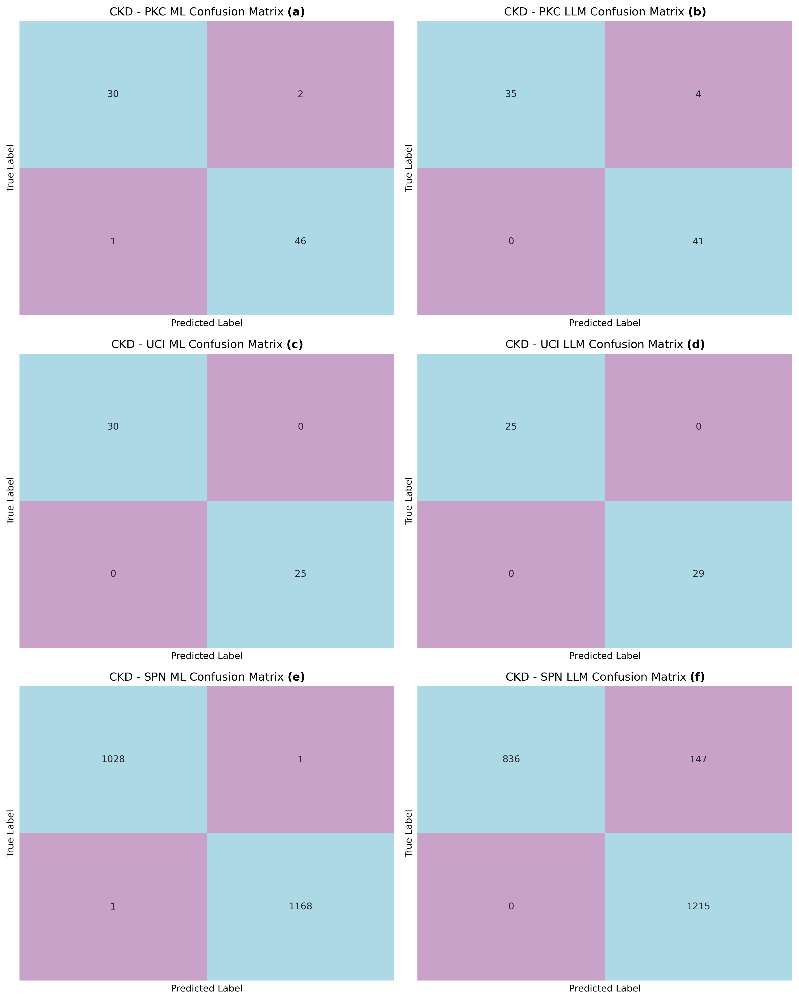

# Natural Language Explainable CKD Prediction via Fine-Tuned LLMs

This repository contains the official implementation and research assets for the paper: **"Natural Language Explainable CKD Prediction via Fine-Tuned LLMs"**. 

This project addresses the challenge of making clinical predictions trustworthy and accessible by fine-tuning Large Language Models (LLMs) to perform Chronic Kidney Disease (CKD) classification while generating human-readable, natural language rationales.

## 📌 Project Overview
While traditional machine learning (ML) models like Random Forest excel at tabular data classification, their "black-box" nature often requires complex post-hoc tools (like SHAP or LIME) that are difficult for clinicians to interpret. Our approach leverages **Table-to-Text Serialization** and **LoRA/QLoRA** fine-tuning to transform medical LLMs into diagnostic tools that explain *why* a prediction was made in plain language.

---

## 🏗️ System Architecture
The framework integrates structured clinical data into a language-based reasoning pipeline. The process involves:
1. **Data Serialization:** Converting tabular patient features into descriptive prompts.
2. **PEFT Fine-Tuning:** Applying LoRA/QLoRA to medical LLMs (e.g., Llama-3-8B or similar architectures).
3. **Inference:** Generating a diagnostic label (CKD/Non-CKD) alongside a patient-specific explanation.


---

## 📊 Experimental Results
We benchmarked our fine-tuned LLM against a Random Forest baseline across three heterogeneous CKD datasets. 

### Performance Metrics
Our results indicate that LLMs achieve comparable classification performance to traditional ensemble methods, particularly on smaller datasets, while offering superior usability through text-based reasoning.


### Confusion Matrix
The following matrix demonstrates the model's accuracy and error rates in a binary classification setting (CKD vs. Healthy).



---

## 💡 Explainability (XAI)
A key contribution of this work is the transition from technical feature-importance plots to **Natural Language Explanations**. This allows healthcare providers to see the reasoning behind a diagnosis directly.


---

## 🚀 Key Features
* **Table-to-Text Integration:** Bridging the gap between structured clinical data and transformer-based language models.
* **Parameter-Efficient Fine-Tuning:** Uses QLoRA to achieve high performance with lower computational cost.
* **Clinical Rationales:** Automatically generates justifications for every prediction to support clinical decision-making.
* **Comparative Study:** In-depth analysis comparing LLMs with traditional Machine Learning models (Random Forest).


---

## 📜 Citation
If you find this research useful, please cite our work:

```bibtex
@article{ckd_llm_2025,
  title={Natural Language Explainable CKD Prediction via Fine-Tuned LLMs},
  author={[Insert Author Names]},
  year={2025},
  journal={[Insert Journal/Conference Name]}
}
